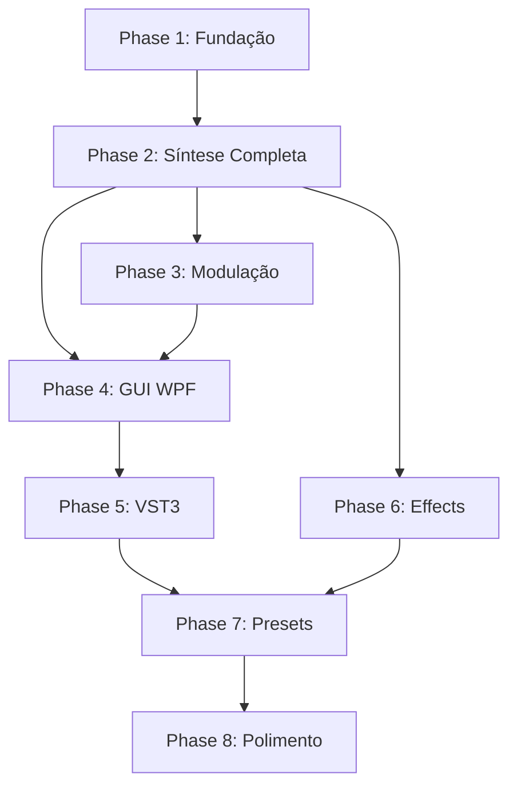

# OttoSynth — Fases de Implementação

> Documento detalhado de todas as fases de desenvolvimento do OttoSynth.
> Cada fase é incremental — o sintetizador evolui de um oscilador básico até um instrumento completo.

---

## Visão Geral

```
Phase 1  ████████████████████  COMPLETA ✅
Phase 2  ████████████████████  COMPLETA ✅
Phase 3  ░░░░░░░░░░░░░░░░░░░░  Pendente
Phase 4  ░░░░░░░░░░░░░░░░░░░░  Pendente
Phase 5  ░░░░░░░░░░░░░░░░░░░░  Pendente
Phase 6  ░░░░░░░░░░░░░░░░░░░░  Pendente
Phase 7  ░░░░░░░░░░░░░░░░░░░░  Pendente
Phase 8  ░░░░░░░░░░░░░░░░░░░░  Pendente
```

---

## Phase 1 — Fundação: Motor DSP Básico ✅

**Objetivo**: Ter áudio saindo de um oscilador controlado por MIDI, com envelope e polifonia. Tudo testável via app standalone.

**Prioridade**: CRÍTICA

### Entregas
| Componente | Arquivo | Status |
|---|---|---|
| Funções matemáticas DSP | `MathUtils.cs` | ✅ |
| Buffer de áudio estéreo | `AudioBuffer.cs` | ✅ |
| Wavetables básicas (Sine, Saw, Square, Triangle) | `BasicWavetables.cs` | ✅ |
| Oscilador wavetable com Hermite interpolation | `WavetableOscillator.cs` | ✅ |
| Envelope ADSR com curvas ajustáveis | `AdsrEnvelope.cs` | ✅ |
| Parser MIDI (NoteOn/Off, PitchBend, CC) | `MidiProcessor.cs` | ✅ |
| Voz sintetizador (oscilador + envelope) | `SynthVoice.cs` | ✅ |
| Gerenciador de vozes (16 polifônicas) | `VoiceManager.cs` | ✅ |
| Motor principal do sintetizador | `SynthEngine.cs` | ✅ |
| App standalone com NAudio + teclado piano | `MainWindow.xaml/.cs` | ✅ |
| 25 testes unitários | `*Tests.cs` | ✅ |

### Capacidades desbloqueadas
- 🎹 Tocar notas via MIDI ou teclado virtual
- 🎵 4 formas de onda (Sine, Saw, Square, Triangle)
- 📈 Envelope ADSR com controles na UI
- 🔊 Polifonia de 16 vozes com voice stealing
- 📊 Visualização de waveform em tempo real

---

## Phase 2 — Síntese Completa ✅

**Objetivo**: Expandir para 3 osciladores completos, filtros, LFOs e unison — transformando o motor básico em um sintetizador com timbre rico e modelável.

**Prioridade**: ALTA

### Entregas

#### 2.1 — Noise Oscillator
| Item | Descrição |
|---|---|
| `NoiseOscillator.cs` | Gerador de ruído branco e rosa |
| White noise | Random com distribuição uniforme |
| Pink noise | Filtrado (-3dB/oitava) via algoritmo Voss-McCartney |
| Controles | Level, tipo (white/pink) |

#### 2.2 — Unison Engine
| Item | Descrição |
|---|---|
| `UnisonEngine.cs` | Empilhamento de até 16 vozes por oscilador |
| Detune spread | Vozes distribuídas simetricamente em torno da frequência central |
| Stereo spread | Vozes distribuídas no panorama L/R |
| Phase randomization | Fase aleatória por voz de unison para evitar cancelamento |

#### 2.3 — Oscilador Expandido
| Item | Descrição |
|---|---|
| Wavetable morphing | Interpolação suave entre frames adjacentes da wavetable |
| Carregamento de .wav | Importar arquivos de áudio como wavetables single-cycle |
| 3 osciladores por voz | Mixer interno com level e pan individuais |

#### 2.4 — Filtro SVF (State Variable Filter)
| Item | Descrição |
|---|---|
| `StateVariableFilter.cs` | Filtro digital SVF com múltiplas saídas |
| Modos | Low-Pass, High-Pass, Band-Pass, Notch |
| Slopes | 12 dB/oct e 24 dB/oct (cascata de 2 SVFs) |
| Parâmetros | Cutoff (20Hz-20kHz, log), Resonance (0-1), Drive (0-1) |
| Key tracking | Cutoff segue a nota MIDI |
| 2 filtros por voz | Com routing: serial, paralelo ou split |

#### 2.5 — LFOs
| Item | Descrição |
|---|---|
| `LfoGenerator.cs` | Oscilador de baixa frequência para modulação |
| Formas | Sine, Triangle, Saw Up, Saw Down, Square, Sample & Hold |
| Rate | Free (0.01-30 Hz) ou Sync ao BPM (1/1, 1/2, 1/4, etc.) |
| Opções | Phase offset, retrigger por nota, stereo offset |
| 3 LFOs por voz | Assignáveis via mod matrix futura |

#### 2.6 — Envelopes Expandidos
| Item | Descrição |
|---|---|
| 3 envelopes por voz | ENV1=Amp, ENV2=Filter, ENV3=Free |
| Curvas ajustáveis | Attack/Decay/Release com curva -1(log) a +1(exp) |

#### 2.7 — MIDI Expandido
| Item | Descrição |
|---|---|
| Pitch Bend completo | 14-bit com range configurável (±2 a ±24 semitones) |
| Mod Wheel (CC#1) | Valor normalizado 0-1, assignável como mod source |
| Aftertouch | Channel pressure como mod source |

### Resultado esperado
- Som muito mais rico e expressivo
- Filtros dão "corpo" ao som (vintage warmth, brightness)
- LFOs criam movimento (vibrato, tremolo, filter sweeps)
- Unison cria sons grossos e largos (supersaw, etc.)

---

## Phase 3 — Sistema de Modulação

**Objetivo**: Criar a Modulation Matrix — o sistema que conecta qualquer fonte de modulação a qualquer parâmetro, dando ao usuário controle total sobre o som.

**Prioridade**: ALTA

### Entregas

#### 3.1 — Modulation Matrix
| Item | Descrição |
|---|---|
| `ModSource.cs` | Enum/classe para todas as fontes de modulação |
| `ModDestination.cs` | Registro de parâmetros moduláveis com ranges |
| `ModRoute.cs` | Conexão Source → Destination com amount e curve |
| `ModMatrix.cs` | Até 32 rotas simultâneas, processamento por tick |

#### 3.2 — Fontes de Modulação (Sources)
| Source | Tipo |
|---|---|
| Envelope 1, 2, 3 | Per-voice, unipolar (0-1) |
| LFO 1, 2, 3 | Per-voice, bipolar (-1 a +1) ou unipolar |
| Velocity | Per-note (0-1) |
| Key Tracking | Per-note (nota MIDI normalizada) |
| Mod Wheel | Global (0-1) |
| Aftertouch | Global/Per-note (0-1) |
| Pitch Bend | Global (-1 a +1) |
| Macro 1-4 | Global (0-1), controlável por knob |
| Random | Per-note (0-1) |

#### 3.3 — Destinos de Modulação (Destinations)
| Categoria | Parâmetros |
|---|---|
| Oscilador | Pitch, Wavetable Position, Level, Pan, Unison Detune |
| Filtro | Cutoff, Resonance, Drive |
| Envelope | Attack, Decay, Sustain, Release |
| LFO | Rate, Depth, Phase |
| Efeitos | Qualquer parâmetro |
| Global | Master Volume, Master Pan |

#### 3.4 — Macro Controls
| Item | Descrição |
|---|---|
| `MacroControl.cs` | 4 macro knobs globais |
| Cada macro | Assignável a múltiplos destinos com amounts individuais |
| UI | 4 knobs na interface principal |

### Resultado esperado
- Modulação de wavetable position por LFO → timbres evolutivos
- Envelope no filtro → sons "plucky" clássicos
- Velocity → expressividade dinâmica
- Macros → "performance knobs" para live

---

## Phase 4 — Interface WPF Completa

**Objetivo**: Criar uma interface gráfica profissional, bonita e funcional, com controles customizados inspirados em Vital/Serum.

**Prioridade**: ALTA

### Entregas

#### 4.1 — Design System
| Item | Descrição |
|---|---|
| `DarkTheme.xaml` | ResourceDictionary com cores, brushes, fontes |
| Palette | Fundo escuro (#0D0D0D), accents neon (cyan, purple, red) |
| Glassmorphism | Painéis semi-transparentes com blur sutil |
| Tipografia | Segoe UI Variable / Inter |

#### 4.2 — Controles Customizados
| Controle | Descrição |
|---|---|
| `SynthKnob` | Knob rotativo com mouse drag, value display, mod ring |
| `SynthSlider` | Slider com bipolar mode e mod indicator |
| `WaveformDisplay` | Waveform em tempo real (WriteableBitmap, 60fps) |
| `SpectrumAnalyzer` | FFT display com escala logarítmica (30fps) |
| `EnvelopeEditor` | ADSR visual com pontos arrastáveis e curvas |
| `LfoDisplay` | Forma de onda do LFO com shape selector |
| `PianoKeyboard` | 2-3 oitavas clicáveis com velocity por posição |
| `ModMatrixGrid` | Grid visual source × destination com drag-and-drop |
| `PresetBrowser` | ComboBox expansível com categorias e search |
| `EffectSlot` | Slot de efeito com bypass, mix e controles |

#### 4.3 — Layout Principal
```
┌──────────────────────────────────────────────────────────┐
│  [Logo] [Preset Browser ▼]  [Macros 1-4]   [Settings]  │
├──────────┬──────────┬──────────┬────────────────────────┤
│  OSC 1   │  OSC 2   │  OSC 3   │   Waveform / Spectrum  │
│ [Knobs]  │ [Knobs]  │ [Knobs]  │   [Visual Display]     │
├──────────┴──────────┴──────────┼────────────────────────┤
│  Filter 1      │  Filter 2     │   Modulation Matrix    │
│  [Knobs]       │  [Knobs]      │   [Drag & Drop Grid]   │
├────────────────┴───────────────┼────────────────────────┤
│  ENV 1  │  ENV 2  │  ENV 3     │   LFO 1 │ LFO 2 │ LFO3│
│  [ADSR] │  [ADSR] │  [ADSR]   │   [Wave] │ [Wave]│[Wav]│
├────────────────────────────────┼────────────────────────┤
│  Effects: [Slots reordenáveis]                          │
├──────────────────────────────────────────────────────────┤
│  [Piano Keyboard]                                        │
└──────────────────────────────────────────────────────────┘
```

### Resultado esperado
- Interface premium dark theme que impressiona visualmente
- Feedback visual em tempo real (waveforms, espectro, modulações animadas)
- Controles intuitivos (knobs com mod rings, envelopes arrastáveis)
- DPI-aware e responsiva

---

## Phase 5 — Integração VST3

**Objetivo**: Empacotar o motor + GUI como plugin VST3 funcional via AudioPlugSharp, testado em DAWs reais.

**Prioridade**: ALTA

### Entregas

#### 5.1 — Plugin VST3
| Item | Descrição |
|---|---|
| `OttoSynthPlugin.cs` | Entry point AudioPlugSharp (`AudioPluginBase`) |
| `ParameterMap.cs` | Mapeamento parâmetros ↔ VST3 (normalized 0-1) |
| `OttoSynthEditor.cs` | GUI WPF embutida no VST3 via AudioPlugSharp |
| NuGet AudioPlugSharp | Framework para o bridge C#/C++ |

#### 5.2 — Parameter Automation
| Item | Descrição |
|---|---|
| Automação | Todos os parâmetros automatizáveis pela DAW |
| Denormalização | Linear, logarítmica e stepped conforme parâmetro |
| Groups | Parâmetros agrupados (OSC1, OSC2, Filter1, etc.) |

#### 5.3 — Validação
| DAW | Teste |
|---|---|
| Reaper | Carregamento, áudio, MIDI, automação |
| Ableton Live | Carregamento, áudio, MIDI |
| FL Studio | Carregamento, áudio, MIDI |
| VST3 Validator (Steinberg) | Conformidade com especificação |

### Resultado esperado
- Plugin .vst3 instalável no diretório padrão
- Funciona em DAWs profissionais
- Parâmetros automatizáveis
- GUI abre corretamente dentro da DAW

---

## Phase 6 — Effects Rack

**Objetivo**: Adicionar cadeia de efeitos globais para finalizar o som dentro do próprio sintetizador.

**Prioridade**: MÉDIA

### Entregas

| Efeito | Descrição | Parâmetros |
|---|---|---|
| **Distortion** | Overdrive, waveshape, bitcrush, foldback | Drive, Mix, Type |
| **Delay** | Stereo, ping-pong, synced | Time/Sync, Feedback, Mix, Filter |
| **Reverb** | Algorithmic (FDN) | Size, Decay, Damping, Pre-delay, Mix |
| **Chorus** | Modulação LFO em delay curto | Rate, Depth, Mix |
| **Phaser** | All-pass filter cascade com LFO | Rate, Depth, Feedback, Mix |
| **Flanger** | Delay muito curto com feedback + LFO | Rate, Depth, Feedback, Mix |
| **EQ** | 3-band parametric (biquad) | Freq, Gain, Q por banda |
| **Compressor** | Dynamics processor | Threshold, Ratio, Attack, Release, Makeup |

#### Infra de efeitos
| Item | Descrição |
|---|---|
| `IEffect.cs` | Interface base para todos os efeitos |
| `EffectsChain.cs` | Lista ordenável com per-effect bypass e mix |
| Drag-and-drop | Reordenar efeitos na UI |

### Resultado esperado
- Sons finalizados dentro do plugin (não precisa de efeitos externos)
- Distortion para agressividade, reverb/delay para espaço
- Cadeia flexível e reordenável

---

## Phase 7 — Sistema de Presets

**Objetivo**: Salvar, carregar e organizar presets. Incluir factory presets para demonstrar as capacidades do sintetizador.

**Prioridade**: MÉDIA

### Entregas

#### 7.1 — Infraestrutura
| Item | Descrição |
|---|---|
| `PresetData.cs` | Classe serializável com TODOS os parâmetros |
| `PresetManager.cs` | Save/Load JSON, scan de diretório, import/export |
| Formato `.ottopreset` | JSON legível e versionado |
| Diretório | `%APPDATA%/OttoSynth/Presets/` |
| Init Preset | Estado "zerado" (OSC1 Saw, Filter LP open, ADSR default) |

#### 7.2 — Factory Presets (50 presets)
| Categoria | Quantidade | Exemplos |
|---|---|---|
| **Bass** | 8 | Sub Bass, Reese, Wobble, FM Bass, Acid |
| **Lead** | 8 | Supersaw, Trance Lead, Pluck Lead, Detuned |
| **Pad** | 8 | Warm Pad, Evolving, Choir, Shimmer |
| **Pluck** | 6 | Bell, Marimba, Kalimba, Pizzicato |
| **Keys** | 5 | Electric Piano, Organ, Clav, Rhodes |
| **FX** | 5 | Riser, Sweep, Noise Texture, Impact |
| **Strings** | 5 | Analog Strings, Cinematic, Slow Attack |
| **Ambient** | 5 | Drone, Atmosphere, Texture, Ethereal |

#### 7.3 — UI do Preset Browser
| Feature | Descrição |
|---|---|
| Lista por categoria | Filtro por Bass, Lead, Pad, etc. |
| Search | Busca por nome ou tag |
| Save / Save As | Salvar preset atual com metadados |
| Favoritos | Marcar presets favoritos |
| A/B Compare | Comparar preset atual com último salvo |

### Resultado esperado
- 50 presets mostrando a versatilidade do sintetizador
- Fácil de salvar/carregar/organizar presets
- Presets compartilháveis (arquivos JSON)

---

## Phase 8 — Polimento e Otimização

**Objetivo**: Refinar qualidade sonora, adicionar features avançadas, otimizar performance e preparar para release.

**Prioridade**: MÉDIA

### Entregas

#### 8.1 — Filtros Avançados
| Item | Descrição |
|---|---|
| `MoogLadderFilter.cs` | Modelo Huovilainen com não-linearidade (tanh) |
| Moog 24dB/oct | 4 polos com feedback, 2x oversampling |
| Comb Filter | Efeitos metálicos e Karplus-Strong |
| Formant Filter | Simulação vocal (A, E, I, O, U) |

#### 8.2 — Wavetable Editor
| Item | Descrição |
|---|---|
| Desenho livre | Desenhar waveforms com mouse |
| Import áudio | Converter arquivo .wav em wavetable |
| FFT editing | Editar harmonics individualmente |
| Morph entre frames | Criação de wavetables multi-frame |

#### 8.3 — Efeitos Adicionais
| Efeito | Descrição |
|---|---|
| Chorus avançado | Multi-voice, stereo spread |
| Phaser | 4/8/12 stages |
| Flanger | Com negative feedback |
| EQ | 3-band parametric com visual |
| Compressor | RMS/Peak, sidechain |

#### 8.4 — Performance
| Item | Descrição |
|---|---|
| SIMD (System.Numerics) | Operações vetoriais em batch de samples |
| BenchmarkDotNet | Benchmarks de throughput |
| GC tracking | Verificar zero-alloc no audio thread |
| CPU profiling | dotTrace / VS Profiler |
| Targets | < 25% CPU com 16 vozes + FX @ 44100/256 |

#### 8.5 — Qualidade
| Item | Descrição |
|---|---|
| Oversampling | 2x/4x para distortion e filtros não-lineares |
| DC offset removal | Filtro high-pass sutil (5Hz) no output |
| Dithering | Noise shaping para quantização 16-bit |
| Crossfade de presets | Transição suave ao trocar presets |

#### 8.6 — Documentação
| Item | Descrição |
|---|---|
| `user-manual.md` | Manual do usuário com screenshots |
| `architecture.md` | Documentação técnica da arquitetura |
| `dsp-guide.md` | Guia dos algoritmos DSP implementados |
| README.md | Visão geral, instalação, uso |

### Resultado esperado
- Qualidade sonora profissional
- CPU otimizado para uso real em produção musical
- Filtros Moog para som "vintage"
- Documentação completa

---

## Cronograma Estimado

| Phase | Complexidade | Estimativa |
|---|---|---|
| Phase 1 ✅ | Média | Concluída |
| Phase 2 | Alta | 2-3 sessões |
| Phase 3 | Média-Alta | 1-2 sessões |
| Phase 4 | Alta | 2-3 sessões |
| Phase 5 | Média | 1-2 sessões |
| Phase 6 | Alta | 2-3 sessões |
| Phase 7 | Média | 1-2 sessões |
| Phase 8 | Alta | 3-4 sessões |

---

## Dependências entre Fases



> **Phase 1→2→3** é o caminho crítico do DSP engine.
> **Phase 4** depende de 2 e 3 para ter todos os parâmetros a exibir.
> **Phase 5** depende de 4 para ter a GUI a embutir no VST3.
> **Phase 7** depende de 5 e 6 para serializar todos os parâmetros.
