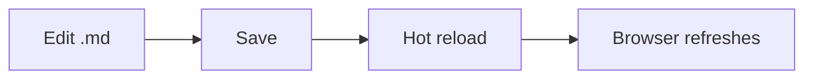

# OttoSynth — Documentação

Site Docusaurus com toda a documentação técnica do OttoSynth.

## Rodar localmente

### Com Docker (recomendado)

```bash
# Desenvolvimento (hot-reload):
docker compose --profile dev up

# Produção (build estático, serve via nginx):
docker compose up

# Em ambos os casos:
# → abre em http://localhost:3000
```

### Sem Docker

Requer **Node.js 20+**.

```bash
npm install
npm start            # dev server em http://localhost:3000
npm run build        # build estático em ./build
npm run serve        # serve o build estático
```

## Estrutura

```
.docs/
├── docs/                       # markdown source (numbered prefix = sidebar order)
│   ├── 01-VisaoGeral.md
│   ├── 02-Arquitetura.md
│   ├── ...
│   └── 12-Referencias.md
├── src/
│   └── css/
│       └── custom.css          # tema Matrix/Cyberpunk
├── static/
│   └── img/                    # assets estáticos
├── docusaurus.config.js        # configuração principal
├── sidebars.js                 # estrutura da sidebar
├── package.json
├── Dockerfile                  # multi-stage (dev + prod)
├── docker-compose.yml
└── README.md (este)
```

## Editando

1. Edite qualquer `.md` em `docs/`.
2. Front matter requerido:
   ```yaml
   ---
   sidebar_position: N
   title: Título da página
   ---
   ```
3. Mermaid diagrams: use blocos ```` ```mermaid ```` — renderizam automaticamente.
4. Admonitions: `:::tip` / `:::info` / `:::warning` / `:::danger`.
5. Em modo dev (`docker compose --profile dev up`), edições são auto-refletidas.

## Diagrama mermaid de exemplo



## Tema

O tema usa paleta **Matrix / cyberpunk**:
- Background: `#030605` (near-black com green tint)
- Accent primário: `#00FF41` (phosphor green)
- Accent amber: `#FFB000` (terminal alt)
- Font: Cascadia Mono / Consolas (monospace)

Para customizar, edite `src/css/custom.css`.
