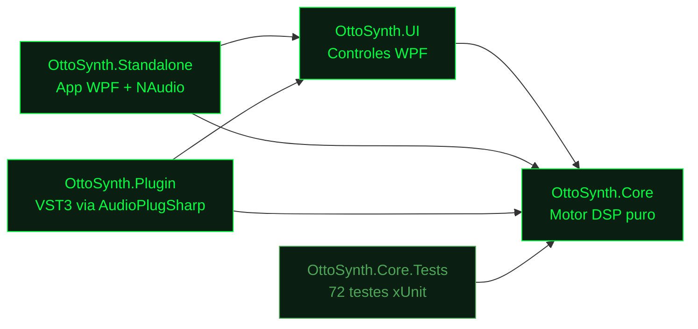
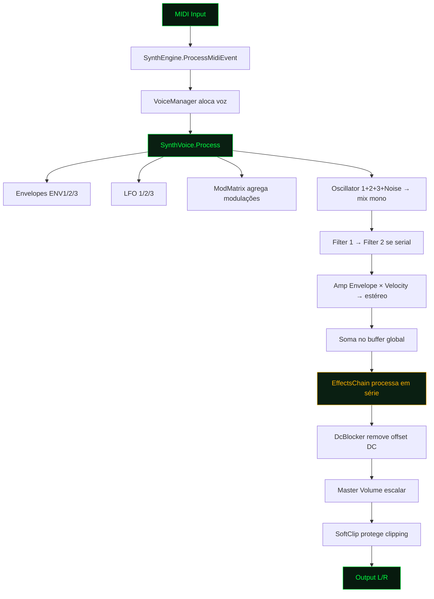

# OttoSynth — Visão Geral do Projeto

:::info Comece aqui
Este é o documento de referência principal. Leia primeiro; ele resume a arquitetura e aponta para os demais documentos.
:::

## 1. O que é o OttoSynth?

O **OttoSynth** é um **sintetizador wavetable polifônico** desenvolvido em **C# / .NET 10**, com os seguintes objetivos:

- Funcionar como **plugin VST3** (carregável em Ableton Live, FL Studio, Reaper, etc.) através do framework AudioPlugSharp.
- Funcionar como **aplicativo standalone** para desenvolvimento, testes e uso direto.
- Oferecer um motor DSP de qualidade profissional (3 osciladores wavetable, 2 filtros, 3 envelopes, 3 LFOs, modulation matrix completa, cadeia de efeitos).
- Ter uma interface gráfica WPF inspirada em **Vital** e **Serum**, com controles customizados (knobs, displays de waveform, FFT, etc.).

A arquitetura é dividida em **4 assemblies principais** + **1 de testes**:



Esta separação garante que o motor (Core) é **totalmente desacoplado** de plataforma, UI e formato de plugin — só depende de `System.*` da BCL.

---

## 2. Princípios de design

Estes princípios são respeitados em todo o código e devem ser preservados em manutenção:

### 2.1 Zero-allocation no audio thread
O método `SynthEngine.ProcessAudio(...)` e tudo o que ele chama **nunca** aloca memória no heap. Todos os buffers, vozes, filtros e efeitos são pré-alocados nos construtores. Isso evita pausas do Garbage Collector que causariam glitches de áudio.

> **Regra de manutenção**: ao editar qualquer código chamado pelo audio thread, NUNCA use `new`, `List<T>.Add()` que cause realloc, ou `string` concatenations.

### 2.2 Separação UI ↔ Audio
- O audio thread roda em uma thread dedicada (controlada pelo NAudio em standalone, ou pelo DAW em VST3).
- A UI atualiza-se em outra thread (a UI thread do WPF).
- Comunicação UI → engine é feita por simples writes em campos atômicos (`double` é atômico em .NET 64-bit).
- Comunicação engine → UI é feita lendo snapshots do estado (não há eventos disparados pelo audio thread).

### 2.3 Componentes plugáveis
Cada componente DSP é uma classe independente (`WavetableOscillator`, `StateVariableFilter`, `AdsrEnvelope`, etc.) com sua própria interface bem definida. Isso facilita testes unitários e substituição.

### 2.4 Internal-DSP em `double`, output em `float`
Todo o processamento interno usa `double` (64-bit). A conversão para `float` 32-bit acontece apenas na fronteira VST3/NAudio. Isso reduz acúmulo de erros numéricos em filtros com alta ressonância e em cadeias longas de efeitos.

---

## 3. Como o som é produzido (visão alta)



:::tip Onde está o código?
O fluxo está implementado principalmente em `SynthVoice.Process` e `SynthEngine.ProcessAudio`.
:::

---

## 4. Mapa dos documentos `.docs`

| Documento | O que cobre |
|---|---|
| **`01-VisaoGeral.md`** (este) | Resumo, arquitetura, princípios |
| **`02-Arquitetura.md`** | Detalhe de cada assembly, separação de responsabilidades, sample/buffer flow |
| **`03-DSP-Engine.md`** | Como cada componente DSP funciona (osciladores, filtros, envelopes, LFOs) |
| **`04-Modulation-System.md`** | Modulation Matrix, sources, destinations, macros |
| **`05-Effects-Rack.md`** | Cada efeito (Distortion, Delay, Reverb, Chorus, Phaser, Flanger, EQ, Compressor) |
| **`06-Voice-Management.md`** | Voice allocation, polifonia, voice stealing |
| **`07-UI-Controls.md`** | Cada controle WPF customizado (SynthKnob, WaveformDisplay, etc.) |
| **`08-Preset-System.md`** | Formato de preset, save/load, factory presets |
| **`09-VST3-Plugin.md`** | Como funciona o wrapper VST3 via AudioPlugSharp |
| **`10-Como-Manter.md`** | Guia de manutenção: onde mudar o quê, debug, performance |
| **`11-Arquivos-Por-Pasta.md`** | Lista de todos os arquivos `.cs` com seu propósito |

---

## 5. Quick reference — "Onde eu mudo X?"

| Quero mudar... | Vá para |
|---|---|
| Adicionar uma nova forma de onda | `BasicWavetables.cs` ou crie wavetables em disco |
| Adicionar um novo tipo de filtro | Crie em `DSP/Filters/`, instancie em `SynthVoice` |
| Adicionar um novo efeito | Crie em `DSP/Effects/` herdando `EffectBase`, registre em presets se quiser |
| Adicionar uma nova source de modulação | Edite `ModSource` enum + `ModMatrix.SetVoiceSources` |
| Adicionar um novo destino de modulação | Edite `ModDestination` enum + `ModDestinationInfo.GetInfo` + lógica em `SynthVoice.ApplyModulation` |
| Mudar layout da UI | `OttoSynth.Standalone/MainWindow.xaml` |
| Mudar cores/tema | `OttoSynth.UI/Themes/DarkTheme.xaml` |
| Adicionar um parâmetro VST3 | `OttoSynth.Plugin/OttoSynthPlugin.cs` (método `Initialize`) |
| Criar um preset factory | `OttoSynth.Core/Preset/FactoryPresets.cs` |

---

## 6. Build e execução

```powershell
# Restaurar packages
dotnet restore OttoSynth.slnx

# Build da solução inteira
dotnet build OttoSynth.slnx -c Release

# Rodar standalone
dotnet run --project src/OttoSynth.Standalone -c Release

# Rodar testes
dotnet test tests/OttoSynth.Core.Tests
```

### Empacotamento VST3
Para empacotar como VST3, siga o procedimento documentado pelo AudioPlugSharp:
1. Build `OttoSynth.Plugin` em Release.
2. Copie o `AudioPlugSharpVst.vst3` (do package) renomeando para `OttoSynth.PluginBridge.vst3`.
3. Copie o `*.runtimeconfig.json` apropriado.
4. Deposite os arquivos em `C:\Program Files\Common Files\VST3\OttoSynth\`.

> Detalhes em `09-VST3-Plugin.md`.

---

## 7. Estado de cada fase do projeto

| Fase | Status | Descrição |
|---|---|---|
| Fase 1 — Fundação DSP | ✅ Completa | Motor básico, polifonia, MIDI |
| Fase 2 — Síntese completa | ✅ Completa | 3 osc + warp Serum-style, 2 filtros, 3 envelopes, 3 LFOs |
| Fase 3 — Modulation Matrix | ✅ Completa | 32 rotas, 18+ sources, ~25 destinations |
| Fase 4 — UI WPF | ✅ Completa | Custom controls + layout Matrix/cyberpunk completo |
| Fase 5 — Plugin VST3 | ✅ Completa | Entry point + parameter mapping |
| Fase 6 — Effects Rack | ✅ Completa | 8 efeitos |
| Fase 7 — Preset System | ✅ Completa | JSON + 50 factory presets |
| Fase 8 — Polimento | ✅ Completa | Moog Ladder, DC blocker, tests adicionais |
| Fase 9 — Filtros & UX | ✅ Completa | 11 modos de filtro (Simper TPT, K35, Comb, Moog integrado); SynthKnob com input manual popup; layout responsivo |

---

## 8. Atalhos importantes

| Atalho | Onde |
|---|---|
| Tudo do motor está em `SynthEngine` | `src/OttoSynth.Core/SynthEngine.cs` |
| Cada voz é uma instância de | `src/OttoSynth.Core/Voice/SynthVoice.cs` |
| O ponto de entrada do VST3 é | `src/OttoSynth.Plugin/OttoSynthPlugin.cs` |
| A janela principal standalone é | `src/OttoSynth.Standalone/MainWindow.xaml` |
| Os testes estão em | `tests/OttoSynth.Core.Tests/` |

---

> **Próximo passo**: leia `02-Arquitetura.md` para entender a estrutura dos assemblies e o data flow em detalhe.
