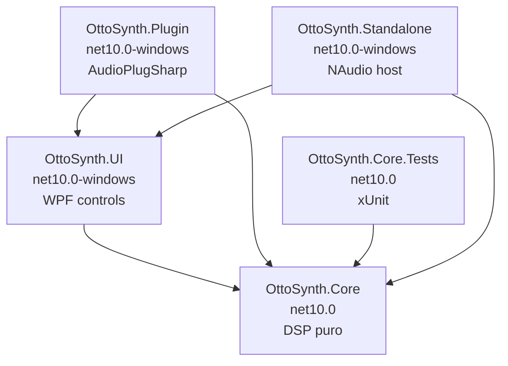

# OttoSynth — Arquitetura

:::info
Detalhe técnico dos 4 assemblies, suas dependências e o fluxo de áudio/MIDI.
:::

## 1. Diagrama de dependências



:::tip Princípio
As setas só apontam para cima — **nada** abaixo de `Core` pode depender da UI ou de hosts (VST3, NAudio).
:::

---

## 2. OttoSynth.Core — o motor

Single dependency: **a BCL .NET 8**. Nada mais.

### 2.1 Estrutura de pastas
```
src/OttoSynth.Core/
├── DSP/
│   ├── Effects/        → IEffect, EffectBase, e 8 efeitos
│   ├── Envelopes/      → AdsrEnvelope
│   ├── Filters/        → StateVariableFilter, MoogLadderFilter
│   ├── Modulation/     → ModSource, ModDestination, ModRoute,
│   │                     ModMatrix, MacroControls, LfoGenerator
│   ├── Oscillators/    → WavetableOscillator, NoiseOscillator,
│   │                     UnisonEngine, BasicWavetables
│   └── Utils/          → MathUtils, AudioBuffer, DcBlocker
├── Midi/               → MidiProcessor, MidiEvent
├── Preset/             → PresetData, PresetManager, FactoryPresets
├── Voice/              → SynthVoice, VoiceManager
└── SynthEngine.cs      → fachada principal
```

### 2.2 Pontos de entrada
| Método | Quando é chamado | O que faz |
|---|---|---|
| `SynthEngine.Initialize(sampleRate, bufferSize)` | Pelo host quando o áudio é iniciado | Configura todos os componentes para o sample rate |
| `SynthEngine.ProcessMidiEvent(midiEvent)` | Cada nota / CC do MIDI | Aciona / libera notas, ajusta pitchbend, etc. |
| `SynthEngine.ProcessAudio(left, right, count)` | Pelo host a cada bloco de áudio | Gera N samples para os 2 canais |

> Tudo o que o motor faz é orquestrado por estes 3 métodos.

### 2.3 Thread safety
- `ProcessAudio` é chamado de **UMA SÓ THREAD** (a do host de áudio).
- Setters de parâmetros (`MasterVolume`, `SetFilter`, etc.) podem ser chamados da UI thread.
- Não há locks — confiamos na atomicidade de writes de `double`/`int`/`bool` no .NET 64-bit + na inocuidade de race conditions cosméticas (um parâmetro pode atualizar 1 amostra antes ou depois).

---

## 3. OttoSynth.UI

Contém **apenas** controles WPF reutilizáveis:
- `SynthKnob` — knob rotativo
- `WaveformDisplay` — wave em tempo real
- `SpectrumAnalyzer` — FFT display
- `EnvelopeEditor` — visualização ADSR
- `LfoDisplay` — visualização de forma de onda LFO
- `PianoKeyboard` — teclado clicável
- `ModMatrixGrid` — listagem visual de rotas de modulação
- `EffectSlot` — slot de efeito com bypass/mix

Mais o `DarkTheme.xaml` em `Themes/`.

Esta DLL **não faz I/O de áudio nem MIDI**; ela só renderiza e captura input. O Standalone fornece dados (via binding ou code-behind).

---

## 4. OttoSynth.Standalone

App WPF executável que:
- Cria um `SynthEngine` instance.
- Usa **NAudio** para fazer:
  - `WaveOutEvent` para enviar áudio à placa de som.
  - `MidiIn` para ler controllers MIDI.
- Hospeda a UI principal com os controles do `OttoSynth.UI`.
- Carrega presets fábrica.

### Loop de áudio (`SynthWaveProvider.Read`)
```
WaveOutEvent (thread NAudio) chama Read(buffer, offset, count)
   │
   ▼
samples = count / (4 * channels)
   │
   ▼
_engine.ProcessAudio(tempLeft, tempRight, samples)
   │
   ▼
Converte double → IEEE float (32-bit) e copia para 'buffer'
   │
   ▼
Salva snapshot do canal esquerdo em _lastBuffer (lock)
   │
   ▼
Retorna ao NAudio
```

A UI thread, num timer de 30fps, lê `_lastBuffer` (lock) e atualiza `WaveformDisplay` e `SpectrumAnalyzer`.

---

## 5. OttoSynth.Plugin

Implementa `AudioPlugSharp.AudioPluginBase` — fornece:
- Metadata (nome, vendor, ID, categoria).
- Lista de parâmetros VST3 (cada um normalizado 0..1 com mapeamento).
- Handlers de NoteOn/NoteOff/CC vindos do DAW.
- Override de `Process()` que chama `_engine.ProcessAudio(...)`.

A DLL resultante é carregada pelo **bridge nativo** AudioPlugSharp (`AudioPlugSharpVst.vst3`), que é renomeado para `OttoSynth.PluginBridge.vst3`.

Detalhes em `09-VST3-Plugin.md`.

---

## 6. Convenções de código

### Naming
- Classes / Properties / Methods: `PascalCase`
- Private fields: `_camelCase` (com underscore)
- Parameters / locals: `camelCase`
- Constants: `PascalCase`
- Interfaces: `IPascalCase`

### Documentação
- Todo método público deve ter um XML doc comment em **inglês**.
- Comentários inline são em inglês exceto em DSP algorithms onde português pode esclarecer.

### Testes
- xUnit
- Naming: `MethodName_Scenario_ExpectedResult`
- Cobertura alvo: 80% para Core (atualmente >70%)

### Performance
- `Math.Pow`, `Math.Sin`, etc. evitar em hot path — usar `MathUtils.FastSin` (lookup table) quando possível.
- Use `[MethodImpl(MethodImplOptions.AggressiveInlining)]` em utilitários muito chamados.
- `Span<T>` para passar buffers sem cópia.
- NUNCA usar `List<T>` no hot path (causa boxing/realloc).

---

## 7. Build configuration

Todos os projetos usam:
```xml
<TargetFramework>net10.0</TargetFramework>   <!-- ou net10.0-windows quando WPF -->
<ImplicitUsings>enable</ImplicitUsings>
<Nullable>enable</Nullable>
```

Tabela:

| Projeto | TargetFramework | UseWPF |
|---|---|---|
| `OttoSynth.Core` | `net10.0` | — |
| `OttoSynth.UI` | `net10.0-windows` | true |
| `OttoSynth.Standalone` | `net10.0-windows` | true |
| `OttoSynth.Plugin` | `net10.0-windows` | true (pelo AudioPlugSharpWPF) |
| `OttoSynth.Core.Tests` | `net10.0` | — |

:::note
O `Core` ser cross-platform (`net10.0`) é proposital: futuras versões Mac/Linux poderão reaproveitar o DSP sem mudanças.
:::

---

## 8. Como o estado é compartilhado entre vozes

Cada `SynthVoice` tem **sua própria** instância de:
- 3 osciladores, 1 noise
- 2 filtros, 3 envelopes, 3 LFOs
- 1 ModMatrix

Mas todos compartilham:
- A mesma referência ao **MacroControls** (set via `VoiceManager.SetMacros`).
- O **mesmo estado de parâmetros base** (cutoff, decay, ...). Os setters do `VoiceManager` propagam para todas as vozes em loop.
- O **EffectsChain** é global (uma instância, processada após todas as vozes mixarem).

> Isso é coerente com o modelo de sintetizador típico: todas as vozes têm os mesmos "knobs", mas estados de envelope/LFO/filtros são independentes (per-voice).

---

## 9. Ciclo de vida de uma nota

```
1. MIDI NoteOn(60, 100) chega via VST3 ou NAudio
2. SynthEngine.ProcessMidiEvent o roteia para VoiceManager.NoteOn(60, 100)
3. VoiceManager aloca uma voz:
   a. Mesma nota já tocando? Retrigger essa voz.
   b. Há voz idle? Use-a.
   c. Caso contrário, voice stealing (ver Voice-Management.md).
4. SynthVoice.NoteOn:
   - Computa frequência (MathUtils.MidiNoteToFrequency)
   - Configura todos os osciladores
   - Reseta fases
   - Trigger dos 3 envelopes (NoteOn)
   - Trigger dos 3 LFOs
5. A voz entra em estado Active.
6. A cada bloco de áudio, SynthVoice.Process:
   - Processa envelopes (gera buffers de gain)
   - Processa LFOs
   - Atualiza ModMatrix (com averages do bloco)
   - Aplica modulações nos parâmetros
   - Gera samples dos osciladores
   - Filtra
   - Multiplica por amp envelope * velocity
   - Soma no output
7. Quando NoteOff chega: SynthVoice.NoteOff → envelopes entram em Release.
8. Quando o envelope ampere termina (sai do release): voz vira Idle.
```

---

> **Próximo**: `03-DSP-Engine.md` para os componentes DSP em detalhe.
