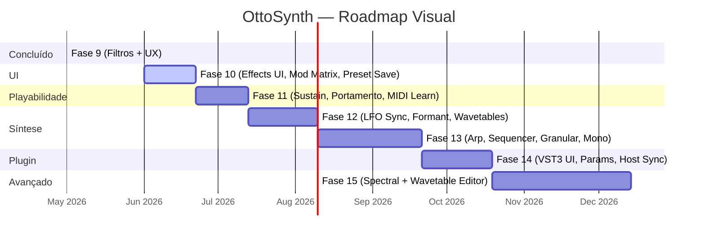

# OttoSynth — Evolução & Roadmap

:::info Objetivo deste documento
Análise honesta do estado atual do OttoSynth frente aos concorrentes do mercado, com gaps identificados, oportunidades de evolução e um roadmap concreto de próximas fases.
:::

---

## 1. Análise dos Concorrentes

### 1.1 Surge XT *(open-source, C++)*

> Repositório: [surge-synthesizer/surge](https://github.com/surge-synthesizer/surge)

O Surge XT é o benchmark de referência para sintetizadores open-source profissionais. Saiu comercial (Vember Audio, 2003) e foi open-sourced em 2018; hoje é mantido por centenas de contribuidores.

**O que tem de relevante:**

| Categoria | Surge XT | OttoSynth atual |
|---|---|---|
| Tipos de osciladores | 10 algoritmos (Classic, Modern, Wavetable, Window, Sine, FM2, FM3, String, Twist, Alias, S&H Noise + Audio Input) | 1 (Wavetable) + Noise |
| LFOs | 12 (6 voice + 6 scene), com MSEG, Step Sequencer, envelope-shaped LFO | 3, formas básicas |
| Filtros | 20+ tipos: LP/HP/BP/Notch 12dB e 24dB, Comb, Allpass, Resonator, Formant | 2 tipos (SVF, Moog Ladder desconectado) |
| Efeitos | 15+ incluindo Ring Modulator, Vocoder, Frequency Shifter, Tape, 53 Airwindows effects | 8 efeitos |
| Macros | 8 macros assignáveis | 4 macros |
| MPE | Suporte completo (pitch bend por nota) | Não |
| Microtonalidade | SCL/KBM, Scala format | Não |
| Scene modes | Dual, Split, Layer (2 patches simultâneos) | Não |
| Plugin formats | VST3, CLAP, AU, LV2, JSFX | Somente VST3 |

**Pontos de diferenciação do Surge:**
- O oscilador **String** usa waveguide synthesis (physical modeling de cordas).
- O oscilador **Twist** é baseado em ressonância (rings out) — único no mercado.
- O MSEG (Multi-Segment Envelope Generator) permite envelopes/LFOs com curvas custom de bezier.
- O modo "Scene" permite dois patches completos carregados simultaneamente (bi-timbral).
- 53 efeitos **Airwindows** embutidos — do vintage console emulation a bizarre artifacts.

---

### 1.2 Vital *(freemium, C++)*

> Site: [vital.audio](https://vital.audio) | Repositório: [mtytel/vital](https://github.com/mtytel/vital)

O Vital é o sintetizador wavetable mais próximo da proposta do OttoSynth (wavetable + modulation-first design). Lançado em 2020 e amplamente considerado o sucessor espiritual do Serum.

**Diferenciais técnicos chave:**

| Categoria | Vital | OttoSynth atual |
|---|---|---|
| Spectral warping | Sim — manipula harmônicos em tempo real (Random Amplitude, Harmonic Stretch, Spectral Time Skew, Data Compress, etc.) | Não |
| Wavetable editor | Embutido (draw, import, text-to-wavetable, pitch-splice, vocode) | Não |
| Modulação audio-rate | Sim (qualquer parâmetro pode ser modulado a taxa de sample) | Não (bloco inteiro = mesmo valor) |
| LFOs custom | Desenho livre de forma do LFO, keytracking de LFO rate | Não |
| Modulation remapping | Curvas de resposta custom por rota | Não |
| Stereo modulation | L/R channels separados como destinos | Não |
| GPU animations | 60fps, oscilloscope, spectrogram | FFT 30fps básico |
| MPE | Sim | Não |
| Microtonalidade | .tun, .scl, .kbd | Não |
| Noise oscillator | Dupla função: noise + sampler | Somente noise |

**Por que o Vital importa:**
A arquitetura de modulation do Vital é o estado da arte: qualquer parâmetro pode ser arrastado para qualquer controle visualmente. Isso transforma o sound design de "configurar rotas numa matriz" para "arrastar e conectar visualmente".

---

### 1.3 Serum 2 *(comercial, Xfer Records)*

> Site: [xferrecords.com/serum-2](https://xferrecords.com/products/serum-2) | Lançado: Março 2025

O Serum original (2014) definiu o padrão do sintetizador wavetable moderno. O Serum 2 expande radicalmente com **5 motores de síntese distintos**:

| Motor | Descrição | OttoSynth |
|---|---|---|
| Wavetable | Frame morphing, dual warps, FM, PD, ring mod | Parcial (sem FM, sem dual warp) |
| Multisample | Instrumento real (orquestra, piano, guitarra) via SFZ | Não |
| Sample | Playback com slicing, loop modulation, tape effects | Não |
| **Granular** | Grain size, density, pitch, scatter por grain | **Não** |
| **Spectral** | Resíntese harmônica em tempo real, transient detection | **Não** |

Além disso:
- **Arpeggiator e Clip Sequencer** embutidos — gera padrões rítmicos sem necessidade de DAW.
- **626+ presets** e **288 wavetables** na instalação base.
- **Routing de efeitos flexível** — cada efeito pode ser roteado para diferentes destinos.

---

### 1.4 Resonarium *(open-source, C++)*

> Repositório: [gabrielsoule/resonarium](https://github.com/gabrielsoule/resonarium)

Um sintetizador de **physical modeling** focado em cordas acopladas via waveguide synthesis.

**O que o Resonarium representa para o OttoSynth:**
- Uma abordagem completamente diferente de síntese — não wavetable, mas modelagem física.
- MPE nativo (Ableton Push 3, ROLI Seaboard) para expressividade por nota (pressão, slide, vibrato por dedo).
- Demonstra que **waveguide synthesis em C++ é viável** como plugin standalone + VST3.
- Sons orgânicos de corda/ressonância que sintetizadores wavetable não conseguem replicar.

---

### 1.5 Arturia Pigments 6 *(comercial)*

O Pigments é o concorrente mais direto em termos de "sintetizador visual moderno":

- **6 motores:** Wavetable, Virtual Analog (VA), Granular, Additive, Harmonic (soma de parciais), Sample.
- **Modal synthesis** (como física de gong/sino) integrada ao motor Harmonic.
- MPE e CV output (para Eurorack).
- Modulação com **curve remapping** por rota.
- **Chord Memory** — toca acorde a partir de uma nota.

---

## 2. Mapa de Gaps — OttoSynth vs Mercado

```mermaid
quadrantChart
    title Cobertura de Features vs Importância Mercado
    x-axis Baixa Prioridade --> Alta Prioridade
    y-axis Não temos --> Temos
    quadrant-1 Manter e polir
    quadrant-2 Implementar logo
    quadrant-3 Adiar / opcional
    quadrant-4 Investigar valor

    Wavetable Morphing: [0.85, 0.85]
    3 Envelopes ADSR: [0.75, 0.90]
    11 Modos de Filtro: [0.80, 0.92]
    8 Efeitos: [0.70, 0.80]
    ModMatrix 32 rotas: [0.80, 0.85]
    Unison (parcial): [0.70, 0.45]
    Knob Input Manual: [0.55, 0.95]
    Granular Synthesis: [0.90, 0.05]
    Spectral Warping: [0.85, 0.05]
    MPE Support: [0.80, 0.05]
    Wavetable Editor: [0.75, 0.05]
    MSEG LFO: [0.70, 0.10]
    Audio-rate Modulation: [0.75, 0.05]
    Arpeggiator: [0.65, 0.05]
    Editor Mod Matrix UI: [0.75, 0.10]
    Preset Save UI: [0.70, 0.10]
    Portamento: [0.72, 0.05]
    Sustain Pedal: [0.68, 0.05]
    CLAP Format: [0.60, 0.05]
    Microtonal: [0.50, 0.05]
    FM Synthesis: [0.70, 0.05]
    Effect Params UI: [0.80, 0.10]
```

### 2.1 Gaps Críticos (alta prioridade, alto impacto)

#### Síntese Granular
O mercado convergiu: Serum 2, Pigments 6, Vital, todos têm granular. É o segundo motor de síntese mais popular depois do wavetable.

- **O que falta:** um `GranularOscillator` que quebra um sample/wavetable em grains (1–100ms), cada um com envelope, pitch, pan e posição independentes.
- **Impacto:** abre texturas, pads etéreos, glitch sounds — impossíveis com wavetable puro.

#### Spectral Warping / Resynthesis
O Vital e o Serum 2 permitem manipular os **harmônicos** de uma onda diretamente.

- **O que falta:** uma camada FFT no oscilador que transforma amplitudes/fases dos bins espectrais antes de reconstruir o sinal.
- **Impacto:** morphing de timbres, vocal-like textures, sons que "evoluem" spectralmente.

#### Audio-rate Modulation
A matriz atual opera **por bloco** (1 valor por buffer de 256 samples). Isso significa que LFOs em 20Hz introduzem um "degrau" a cada 5ms (ziggurat artefact).

- **O que falta:** modo per-sample na `ModMatrix`, onde a source é avaliada a cada sample.
- **Impacto:** FM synthesis, vibrato suave, LFO shapes limpas em frequências altas.

#### Wavetable Editor Embutido
Hoje as wavetables são geradas em código (`BasicWavetables.cs`) ou importadas. O usuário não pode criar/editar wavetables sem compilar.

- **O que falta:** um editor visual (desenho de curva, importação de WAV, text-to-wavetable, FFT-based drawing).
- **Impacto:** diferencial enorme de UX — usuário cria timbre do zero.

---

### 2.2 Gaps Moderados (médio prazo)

#### ✅ Filtros — RESOLVIDO na Fase 9

O `StateVariableFilter` foi reescrito com **5 algoritmos e 11 modos** (veja `03-DSP-Engine.md`):

| Filtro | Status |
|---|---|
| Moog Ladder (conectado) | ✅ Integrado via `FilterMode.MoogLadder` |
| K35 LP / K35 HP (Korg MS-20) | ✅ Implementado |
| Comb Positive / Negative | ✅ Implementado |
| Formant / Vowel | ⬜ Pendente |
| Resonador afinado por nota | ⬜ Pendente |

#### MSEG (Multi-Segment Envelope Generator)
Os 3 envelopes ADSR são funcionais, mas rígidos. Um MSEG permite:
- Envelopes com N segmentos e curvas bezier.
- LFO com forma custom desenhada pelo usuário.
- Looping segmentado (Attack → loop do sustain → release).

#### Suporte a MPE
MPE (MIDI Polyphonic Expression) roteia um canal MIDI por nota, permitindo:
- Pitch bend individual por nota (vibrato por dedo no Roli Seaboard).
- Pressure (channel pressure) independente por nota.
- Slide (CC74) por nota.

Impacto: compatibilidade com Roli Seaboard, Linnstrument, Osmose, Ableton Push 3.

#### Unison Engine (já existe, finalizar integração)
O `UnisonEngine.cs` está implementado mas não integrado ao `SynthVoice`. Só precisa de:
1. Instanciar `UnisonEngine` por oscilador em `SynthVoice`.
2. Expor `UnisonVoices` (1..16) e `UnisonDetune` como parâmetros.
3. Somar as saídas das voices no mix.

---

### 2.3 Gaps de Plataforma & Formato

#### CLAP Plugin Format
O **CLAP** (CLever Audio Plug-in) é o formato emergente com suporte crescente:
- FL Studio, Reaper, Bitwig, Renoise já suportam.
- Vantagens sobre VST3: melhor threading, MIDI 2.0 nativo, modulation per-note sem MPE, open-source sem royalties.
- Desvantagem: Ableton Live, Pro Tools e Cubase ainda não suportam CLAP.

Para o OttoSynth, CLAP seria um segundo plugin format lado a lado com o VST3 existente.

#### Audio Unit (AU) — macOS
Para rodar no Logic Pro (macOS), é necessário o formato AU. O AudioPlugSharp 0.7.9 não suporta AU; exigiria migrar para um framework diferente ou adicionar suporte manual.

---

### 2.4 Gaps de UX e Workflow

#### Arpeggiator / Step Sequencer
Presente em Serum 2, Surge XT, Pigments. Permite criar padrões rítmicos e melódicos sem depender da DAW.

- **Implementação simples:** um `Arpeggiator` que consome as notas ativas e dispara NoteOn/NoteOff programaticamente no tempo do BPM da DAW (recebido via host tempo).

#### Preset Browser com Tags e Pesquisa
O sistema atual carrega 50 factory presets via JSON. Falta:
- Busca por nome.
- Tags (Lead, Pad, Bass, Keys, Fx, Atmo).
- Favoritos marcáveis.
- Preview sonoro ao passar o mouse.

#### Mod Matrix Visual (Drag & Drop)
A mod matrix atual é configurada por código/preset. Vital e Serum têm arraste visual: o usuário clica no label de um parâmetro e arrasta para uma source. Isso reduz drasticamente o tempo de sound design.

#### Microtonalidade (SCL/KBM)
Surge XT suporta arquivos Scala (.scl) e keyboard mapping (.kbm) para afinações não-ocidentais, quarter tones, just intonation, etc. Uma adição relativamente simples: substituir `MidiNoteToFrequency(note)` por uma lookup table configurável.

---

## 3. Roadmap de Evolução

As fases abaixo são ordenadas por impacto vs. esforço.

### ✅ Fase 9 — Filtros & UX *(Concluída — mai/2026)*

1. ✅ **Reescrita do `StateVariableFilter`** — Simper TPT (incondicionalmente estável); 11 modos: LP, HP, BP, Notch, AllPass, Peak, MoogLadder, K35LP, K35HP, CombPositive, CombNegative.
2. ✅ **Bug fix crítico** — `Mode` setter não chamava `UpdateCoefficients()`; áudio parava ao trocar modo.
3. ✅ **`SynthKnob` reescrito** — input manual via popup (double-click), Ctrl+double-click reset, layout responsivo sem dimensões fixas.
4. ✅ **`MainWindow.xaml`** — Grid responsivo para knobs dos OSCs e LFOs; todos os knobs visíveis.
5. ✅ **Filter ComboBox com nomes amigáveis** — "LP 12dB", "Moog 24dB", "K35 LP", "Comb +" etc.

---

### Fase 10 — Completar a UI *(próxima sprint, ~2–3 semanas)*

Tudo aqui tem DSP pronto — falta apenas exposição na interface.

#### 10.1 Editor de Efeitos
- Painel expansível por efeito com knobs para todos os parâmetros
- Cada `EffectSlot` expande ao clicar, mostrando controles específicos do efeito
- Arquivos afetados: `MainWindow.xaml`, `EffectSlot.cs`

#### 10.2 Salvar Presets de Usuário
- Campo de nome + botão "Save" no painel de presets
- `PresetManager.Save()` já existe — falta o botão e diálogo de nome
- Separação visual "Factory" vs "User" na lista
- Arquivos afetados: `MainWindow.xaml.cs`, `MainWindow.xaml`

#### 10.3 Editor da Mod Matrix
- `ModMatrixGrid` hoje é read-only; torná-lo editável
- Dropdown de Source + Destination + knob de Amount por rota
- Botão `+` para adicionar rota, `×` para remover
- Arquivo afetado: `ModMatrixGrid.cs`

#### 10.4 Filtro 2 na UI
- Seção de Filter 2 com Mode, Cutoff, Resonance, Drive
- Seletor de roteamento: Serial / Parallel / Split
- `SynthVoice` já tem as estruturas — falta exposição no `MainWindow` e `PresetData`

#### 10.5 Unison na UI
- `UnisonEngine` implementado mas sem controles expostos
- Knobs: Voices (1–16), Detune, Spread — por oscilador (OSC1, OSC2, OSC3)
- Arquivo afetado: `MainWindow.xaml.cs` + `SynthVoice`

---

### Fase 11 — MIDI & Playabilidade *(~2–3 semanas)*

#### 11.1 Sustain Pedal (CC#64)
Manter notas soando mesmo após Note Off enquanto pedal pressionado. `VoiceManager` precisa de lista "sustain held":

```csharp
private readonly HashSet<byte> _sustainedNotes = new();
private bool _sustainPedal = false;

// Em NoteOff: se pedal pressionado, não libera a voz
// Em CC#64 off: libera todas as notas da lista _sustainedNotes
```

#### 11.2 Portamento / Glide
Deslize suave de frequência entre notas:
- Modos: Off / Legato (só quando overlapping) / Always
- Tempo de glide: 0–2 sec (interpolação linear ou exponencial de frequência)
- Knob "Glide" + toggle Legato/Always na UI
- Arquivo afetado: `SynthVoice.cs` (interpolar `_currentFreq` para `_targetFreq` a cada sample)

#### 11.3 MIDI Learn
- Ctrl+clique em qualquer `SynthKnob` → entra em "learn mode" (borda pisca)
- Próxima mensagem CC recebida → mapeia ao parâmetro
- Dicionário `CC → Action<double>` salvo no preset

#### 11.4 Expression (CC#11) e Aftertouch
- Aftertouch já é `ModSource` — falta processar a mensagem MIDI
- CC#11 → novo `ModSource.Expression`
- Pitchbend range configurável (campo `PitchBendRange` existe em `PresetData`)

#### 11.5 Curva de Velocidade
- Modos: Linear, Logarítmica, Exponencial, Fixed
- Seletor na UI
- Transform aplicado antes de passar `velocity` para `SynthVoice`

---

### Fase 12 — Expansão de Síntese *(~3–4 semanas)*

#### 12.1 LFO Tempo Sync
- Campo `Sync` existe em `LfoData` mas está sempre "Free"
- Modos: Free / 1/1 / 1/2 / 1/4 / 1/8 / 1/16 / dotted / triplet
- Requer BPM no `SynthEngine` (recebido de MIDI Clock ou host VST3)
- Seletor na seção de cada LFO

#### 12.2 Modos de LFO extras
- **Smooth Random** — interpolação linear entre saídas do S&H atual
- **Staircase** — sinal do LFO quantizado em N steps configuráveis
- **One-shot** — dispara apenas 1 ciclo por NoteOn (envelope-like shape)

#### 12.3 Filtro Formant / Vogal
- 3 picos BP com ganho e frequência afinados para vogais (A, E, I, O, U)
- Morphing contínuo entre vogais via um parâmetro 0..4
- Novo `FilterMode.Formant` no `StateVariableFilter`

#### 12.4 Wavetable Library
- Carregar arquivos `.wav` single-cycle como wavetable
- Browser de wavetables na UI
- 15–20 wavetables extras integradas (Vox, Strings, PWM, Super Saw, etc.)
- `SampleImporter.cs` novo: lê WAV mono → `double[]` normalizado

---

### Fase 13 — Features Avançadas *(~4–6 semanas)*

#### 13.1 Arpeggiador

```
Modos: Up / Down / Up-Down / Random / Chord / Order
Divisão: 1/4, 1/8, 1/16, 1/32
Oitavas: 1–4
Gate: 10–100% do step
```

Implementar como `Arpeggiator` que consome `_sustainedNotes` ativas e dispara `NoteOn/NoteOff` na cadência do BPM.

#### 13.2 Step Sequencer (16 passos)
- Cada passo: pitch, velocity, gate, e modulation
- Pode sequenciar parâmetros além de notas
- Sincronizado com BPM do host

#### 13.3 Modo Monofônico / Legato
- Modo Mono: apenas 1 voz ativa
- Retrigger de envelope opcional em legato
- Voice limit configurável (1–16)

#### 13.4 Granular (efeito ou modo do oscilador)
- `GranularOscillator` com pool pré-alocado de `Grain[]` (zero-alloc)
- Parâmetros: Position, GrainSize (ms), Density, Scatter, PitchSpread, PanSpread
- Fontes: frame de wavetable ou arquivo WAV importado

```csharp
private struct Grain {
    public double Position, Rate, Amplitude;
    public double EnvelopePhase, EnvelopeDelta;
    public float PanL, PanR;
    public bool Active;
}
private readonly Grain[] _grainPool = new Grain[MAX_GRAINS];
```

---

### Fase 14 — VST3 & DAW Integration *(~3–4 semanas)*

#### 14.1 UI do Plugin
- `HasUserInterface = true` + editor WPF embedado
- Mesma aparência do Standalone dentro do DAW
- Redimensionamento com aspecto preservado

#### 14.2 Parâmetros Completos (~60 parâmetros automatable)
- Atualmente 16 parâmetros; expandir para todos os knobs do Standalone
- Smooth de parâmetro (ramp 5ms para evitar zipper noise na automação)

#### 14.3 Tempo Sync do Host
- `HostInfo.BPM` do AudioPlugSharp → alimenta LFOs e Arpeggiador
- MIDI Clock no Standalone como alternativa

#### 14.4 Preset System do Plugin
- Salvar/carregar presets via `IEditController::setComponentState`
- Listar factory presets como programas VST3

---

### Fase 15 — Síntese Espectral *(~6–8 semanas)*

#### 15.1 Spectral Warping

FFT offline ao mudar wavetable/parâmetro (não no hot path):

```
1. Frame da wavetable (2048 samples) → FFT → N/2 bins
2. Transformar bins: Harmonic Stretch / Blur / Odd·Even / Phase Randomize / Freeze
3. IFFT → frame modificada → uso na síntese
```

#### 15.2 Wavetable Editor (UI)

Painel WPF dedicado:
- **Draw mode** — mouse drag sample-by-sample
- **Spectral draw** — barras FFT clicáveis (amplitudes de harmônicos)
- **Import WAV** — divide em frames (cada frame = 1 ciclo)
- **Morph** — interpolação entre dois frames
- **Export** — `.otto-wt` (JSON) ou WAV mono

---

## 4. Resumo Executivo: Priorização



| Fase | Foco | Impacto | Risco | Esforço |
|---|---|---|---|---|
| **9** ✅ | Filtros & UX | Alto | Baixo | Médio |
| **10** | Completar UI | Alto | Baixo | Médio |
| **11** | MIDI & Playabilidade | Alto | Baixo | Baixo |
| **12** | Expansão de Síntese | Alto | Médio | Médio |
| **13** | Features Avançadas | Alto | Médio | Alto |
| **14** | VST3 & DAW | Médio | Médio | Médio |
| **15** | Síntese Espectral | Alto | Alto | Alto |

---

## 5. Features de Diferenciação Potencial

Além de "paridade com concorrentes", há oportunidades de **diferenciação** que nenhum dos concorrentes explorou completamente:

### 5.1 Matrix/Cyberpunk como Identidade Visual Forte
Enquanto Vital e Serum usam UIs genéricas modernas, o OttoSynth tem um tema visual único. Isso pode ser expandido:
- **VU meters** animados estilo terminal/radar.
- **Modo "Terminal"** onde parâmetros são exibidos como números ASCII em tempo real.
- **Visualizador de modulação** que mostra as rotas ativas como "neural network" animado.
- **FFT em tempo real** com gradiente verde Matrix (já existe, pode ser expandido para spectrogram waterfall).

### 5.2 Integração Nativa com IA para Preset Generation
Como o projeto é em .NET, integrar a **Anthropic Claude API** (ou similar) para:
- "Descreva o som em texto → gera um preset" (Text-to-Preset).
- "Evolua este preset no estilo de X" — variações programáticas.
- Isso seria uma feature **única no mercado** de sintetizadores standalone.

### 5.3 LFO Baseado em Permutation Tables (DNA-style)
Uma ideia original: LFOs gerados por permutações matemáticas de sequências (sequência de Fibonacci, número de ouro, espiral de DNA). Sonicamente diferente de random ou S&H, cria padrões que não se repetem mas têm coerência.

### 5.4 Patch Morphing Automático (A→B)
Transição suave entre dois presets com interpolação de todos os parâmetros. Como um "tween" de patches — exclusivo no mercado para VST3 (alguns plugins hardware têm, como o Prophet REV2).

---

## 6. Arquitetura de Referência: Granular (Fase 13)

Estrutura de classes alvo:

```
OttoSynth.Core/
└── DSP/
    └── Oscillators/
        ├── WavetableOscillator.cs    (existente)
        ├── GranularOscillator.cs     ← novo (Fase 13)
        │   ├── struct Grain          ← pool pré-alocado, zero-alloc
        │   └── class GrainScheduler  ← determina timing de spawn
        └── SamplePlayer.cs           ← novo (base para granular e import)

    └── IO/
        └── SampleImporter.cs         ← novo (WAV mono → double[])
```

`Grain` como `struct` (value type) é crítico para zero-allocation no audio thread:

```csharp
private struct Grain {
    public double Position;       // posição atual no buffer (samples)
    public double Rate;           // playback rate (pitch)
    public double Amplitude;      // volume atual
    public double EnvelopePhase;  // 0..1 dentro do grain
    public double EnvelopeDelta;  // incremento por sample
    public float PanL, PanR;
    public bool Active;
}

private readonly Grain[] _grainPool = new Grain[MAX_GRAINS];  // alocado no ctor
```

---

## 7. Referências

### Síntese Granular
- Curtis Roads, *Microsound* (MIT Press, 2001) — referência canônica.
- STK `Granulate` class — implementação C++ de referência: [ccrma.stanford.edu/software/stk](https://ccrma.stanford.edu/software/stk/classstk_1_1Granulate.html)
- DSP Labs — Granular Synthesis tutorial: [lcav.gitbook.io/dsp-labs](https://lcav.gitbook.io/dsp-labs/granular-synthesis/implementation)

### Síntese Espectral
- Julius O. Smith, *Spectral Audio Signal Processing* (CCRMA, online): [ccrma.stanford.edu/~jos/sasp](https://ccrma.stanford.edu/~jos/sasp/)
- Artigo: *Spectral Granular Synthesis* (ResearchGate, 2018).

### MPE
- Especificação oficial MIDI Association: [midi.org/mpe](https://www.midi.org/midi-articles/midi-polyphonic-expression-mpe)
- Surge XT MPE implementation — referência de código C++.

### CLAP
- Especificação CLAP: [github.com/free-audio/clap](https://github.com/free-audio/clap)
- `clap-sharp` — binding C#: [github.com/free-audio/clap-sharp](https://github.com/free-audio/clap-sharp) *(verificar maturidade antes de adotar)*

### Filtros
- Robert Bristow-Johnson, *Audio EQ Cookbook* (já usado no `Eq3Band.cs`).
- Vähäkangas, *Huovilainen's Moog Ladder* (implementado em `MoogLadderFilter.cs`, integrado via `FilterMode.MoogLadder`).
- Andy Simper (Cytomic), *Solving the Continuous SVF Equations* (2013) — base do Simper TPT SVF implementado no `StateVariableFilter.cs`.
- Hohnerlein & Rest, *K35 filter topology* — base do K35 LP/HP implementados.
- *The Formant Filter* — DAFX: Digital Audio Effects, Zölzer (cap. 2).

### Concorrentes Analisados
- Surge XT: [surge-synthesizer.github.io](https://surge-synthesizer.github.io)
- Vital: [vital.audio](https://vital.audio) | [github.com/mtytel/vital](https://github.com/mtytel/vital)
- Serum 2: [xferrecords.com/products/serum-2](https://xferrecords.com/products/serum-2)
- Resonarium: [github.com/gabrielsoule/resonarium](https://github.com/gabrielsoule/resonarium)
- Pigments 6: [arturia.com/products/pigments](https://www.arturia.com/products/software-instruments/pigments/overview)

---

> **Nota de manutenção:** Este documento deve ser atualizado ao final de cada fase entregue, marcando o status na tabela de priorização e adicionando notas de decisão arquitetural que surgiram durante a implementação.
